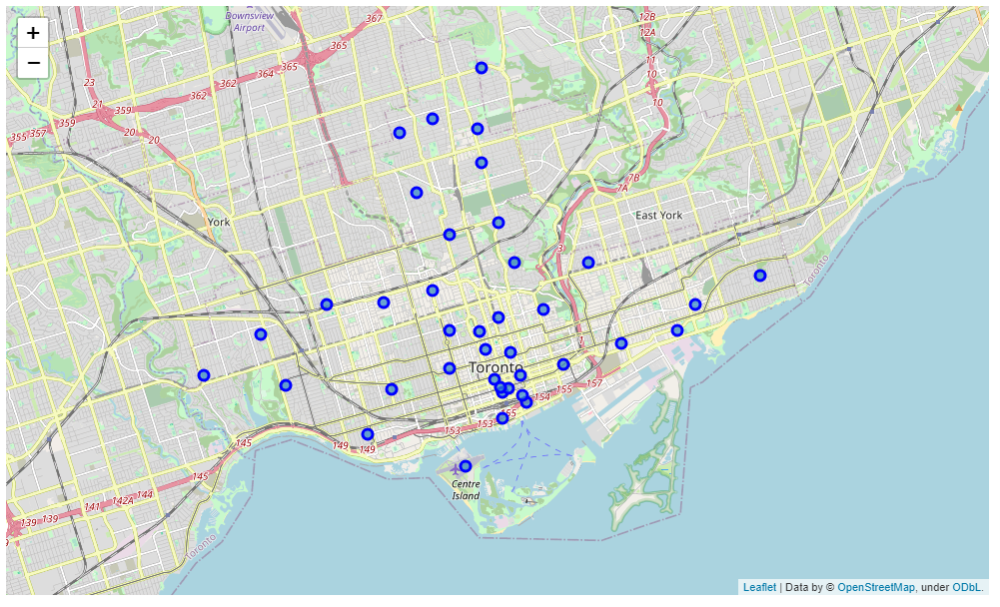
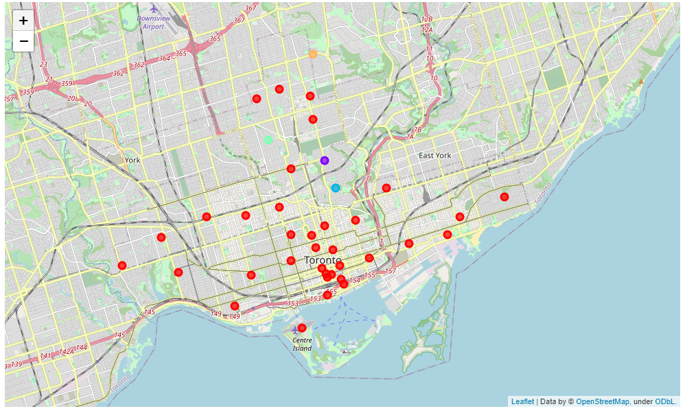

# Segmenting and Clustering Neighborhoods in Toronto

## For all code check Segmenting_and_Clustering_Neighborhoods_in_Toronto.ipynb

In this assignment, I had to explore, segment, and cluster the neighborhoods in the city of Toronto.

For the Toronto neighborhood data, a Wikipedia page exists that has all the information we need to explore and cluster the neighborhoods in Toronto. I had to scrape the Wikipedia page and wrangle the data, clean it, and then read it into a pandas dataframe so that it is in a structured format.

Once the data is in a structured format, I had explore and cluster the neighborhoods in the city of Toronto.

## I had to remove all API keys from the code, so You cannot see MAP vizualisations.

There are 2 images that represents Toronto Neighborhoods:

## 1) Toronto Neighborhoods

## 2) Clustered_Toronto_Neighborhoods

